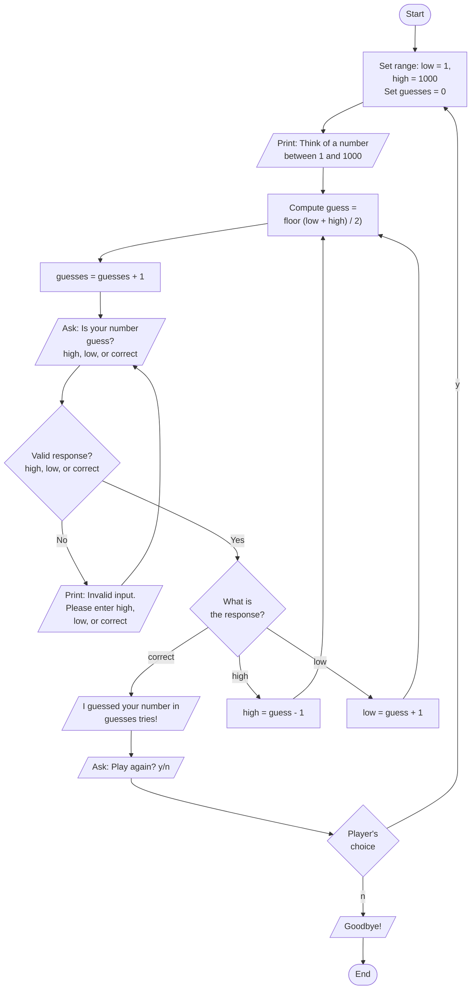

```mermaid
%%Author: Grace Garrett

%%Student ID: 13260436

%%Date Last Modified: 15/04/2026


flowchart TD

A([Start]) --> B[Set range: low = 1, \nhigh = 1000\nSet guesses = 0]

B --> C[/Print: Think of a number\nbetween 1 and 1000/]

C --> D["Compute guess = \nfloor (low + high) / 2)"]

D --> E[guesses = guesses + 1]

E --> F[/Ask: Is your number\nguess?\nhigh, low, or correct/]

F --> G{Valid response?\nhigh, low, or correct}

G -- No --> H[/Print: Invalid input.\nPlease enter high,\nlow, or correct/]

H --> F

G -- Yes --> I{What is\nthe response?}

I -- correct --> J[/"I guessed your number in \nguesses tries!"/]

I -- high --> K[high = guess - 1]

I -- low --> L[low = guess + 1]

K --> D

L --> D

J --> M[/Ask: Play again? y/n/]

M --> N{Player's\nchoice}

N -- y --> B

N -- n --> O[/"Goodbye!"/]

O --> P([End])

%% flowchart TD - Draws the flowchart from Top Down

%% ([Start]) and ([End]) - Stadium shapes for the start and end terminals

%% [Set range] - Rectangle for initialising variables before the game begins

%% [/Print/] and [/Ask/] - Parallelograms for input and output operations

%% ["Compute guess = floor()"] - Quoted rectangle to allow special characters

%% {Valid response?} - Diamond for input validation, loops back if response is invalid

%% {What is the response?} - Diamond for three-way branch: high, low, or correct

%% K --> D and L --> D - Binary search loop arrows, narrowing the range each iteration

%% N -- y --> B - Play again loop arrow, restarts the game from initialisation

```

