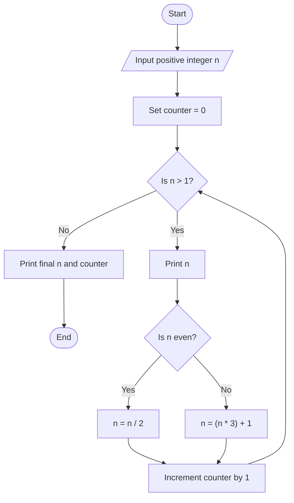
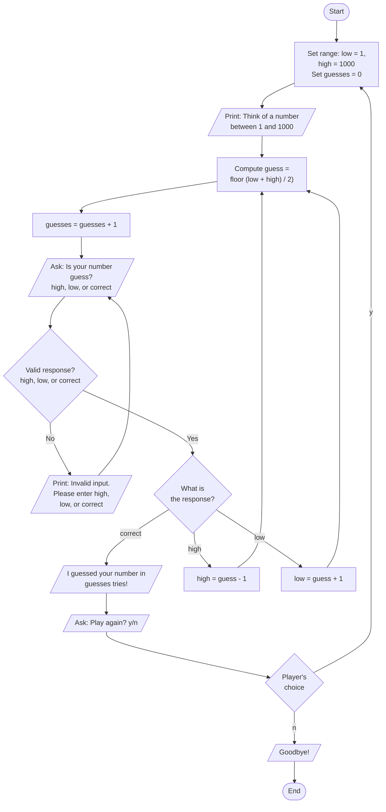

# Automated Processes – AT2

**Grace Garrett** | 13260436 | ICTPRG434 Automate Processes (22603VIC) | April 15, 2026

---

## Table of Contents

- [Introduction](#introduction)
- [Task 1 – The Collatz Conjecture Flowchart](#task-1--the-collatz-conjecture-flowchart)
- [Task 2 – The Reverse Guess the Number Game](#task-2--the-reverse-guess-the-number-game)
- [Task 3 – The Multiplication Trace Table](#task-3--the-multiplication-trace-table)
- [Task 4 – The Fibonacci Sequence Trace Table](#task-4--the-fibonacci-sequence-trace-table)
- [Task 5 – Relationship Between Circles Pseudocode](#task-5--relationship-between-circles-pseudocode)
- [Task 6 – Bubble Sort Pseudocode](#task-6--bubble-sort-pseudocode)
- [Task 7 – Walking Directories Pseudocode](#task-7--walking-directories-pseudocode)
- [Task 8 – Debugging URL Checker Script](#task-8--debugging-url-checker-script)
- [Task 9 – Debugging Running Host Script](#task-9--debugging-running-host-script)
- [Task 10 – Debugging File Sorter Script](#task-10--debugging-file-sorter-script)
- [References](#references)

---

## Introduction

---

## Task 1 – The Collatz Conjecture Flowchart



---

## Task 2 – The Reverse Guess the Number Game




---

## Task 3 – The Multiplication Trace Table

### The Python Example Code

```python
n = 4 
for i in range(1, n + 1): 
    for j in range(1, n + 1): 
        print(i * j, end="\t") 
        print("\n")
```

### The Resulting Multiplcation Trace Table

| **Iteration** | **i** | **j** | **i × j Output** |
| --- | --- | --- | --- |
| 1 | 1 | 1 | 1 |
| 2 | 1 | 2 | 2 |
| 3 | 1 | 3 | 3 |
| 4 | 1 | 4 | 4 |
| 5 | 2 | 1 | 2 |
| 6 | 2 | 2 | 4 |
| 7 | 2 | 3 | 6 |
| 8 | 2 | 4 | 8 |
| 9 | 3 | 1 | 3 |
| 10 | 3 | 2 | 6 |
| 11 | 3 | 3 | 9 |
| 12 | 3 | 4 | 12 |
| 13 | 4 | 1 | 4 |
| 14 | 4 | 2 | 8 |
| 15 | 4 | 3 | 12 |
| 16 | 4 | 4 | 16 |

---

## Task 4 – The Fibonacci Sequence Trace Table

### The Python Example Code

``` python
def fibonacci(n): 
    a, b = 0, 1 
    for i in range(n): 
        print(f"\n{a}")
        a, b = b, a + b

fibonacci(6)
```

### The Resulting Fibonacci Sequence Trace Table

| **Iteration** | **a** | **b** | **Output** |
| --- | --- | --- | --- |
| 1 | 0 | 1 | 0 |
| 2 | 1 | 1 | 1 |
| 3 | 1 | 2 | 1 |
| 4 | 2 | 3 | 2 |
| 5 | 3 | 5 | 3 |
| 6 | 5 | 8 | 5 |
| 7 | 8 | 13 | 8 |

---

## Task 5 – Relationship Between Circles Pseudocode

```pseudocode
//Task 5 - Relationship Between Circles
//Name: Grace Garrett
//Date: 23/04/2026

BEGIN

    // Get and validate inputs
    REPEAT
        PRINT "Enter the radius of Circle A: "
        INPUT radius_A
        IF radius_A is not a number THEN
            PRINT "Invalid input. Please enter a number."
        ELSE IF radius_A <= 0 THEN
            PRINT "Invalid input. Radius must be a positive number."
        END IF
    UNTIL radius_A is a valid positive number

    
    REPEAT
        PRINT "Enter the radius of Circle B: "
        INPUT radius_B
        IF radius_B is not a number THEN
            PRINT "Invalid input. Please enter a number."
        ELSE IF radius_B <= 0 THEN
            PRINT "Invalid input. Radius must be a positive number."
        END IF
    UNTIL radius_B is a valid positive number

    
    REPEAT
        PRINT "Enter the distance between the centres: "
        INPUT D
        IF D is not a number THEN
            PRINT "Invalid input. Please enter a number."
        ELSE IF D < 0 THEN
            PRINT "Invalid input. Distance cannot be negative."
        END IF
    UNTIL D is a valid non-negative number

    // Convert inputs from strings to integers
    SET radius_A = TO_INTEGER(radius_A)
    SET radius_B = TO_INTEGER(radius_B)
    SET D = TO_INTEGER(D)

    
    // Determine the relationship
    IF (D + radius_A) < radius_B THEN
        PRINT "Circle A is inside Circle B"
    
    ELSE IF (D + radius_B) < radius_A THEN
        PRINT "Circle B is inside Circle A"
    
    ELSE IF (radius_A + radius_B) > D AND D > ABS(radius_A - radius_B) THEN
        PRINT "The circles are overlapping"
    
    ELSE
        PRINT "The circles do not overlap"
    
    END IF

END
```

---

## Task 6 – Bubble Sort Pseudocode

```pseudocode
// Task 6 - Bubble Sort
//Name: Grace Garrett
//Date: 20/04/2026

BEGIN

    // Get the list to sort
    PRINT "Enter a list of numbers: "
    INPUT list
    SET n = LENGTH(list)

    // Outer loop - runs n-1 passes
    FOR i FROM 0 TO n - 1 DO

        SET swapped = FALSE

        // Inner loop - compares adjacent elements
        FOR j FROM 0 TO n - i - 2 DO

            IF list[j] > list[j + 1] THEN
                // Swap the two elements
                SET temp = list[j]
                SET list[j] = list[j + 1]
                SET list[j + 1] = temp
                SET swapped = TRUE
            END IF

        END FOR

        // If no swaps were made, the list is already sorted
        IF swapped = FALSE THEN
            BREAK
        END IF

    END FOR

    PRINT "Sorted list: " + list

END
```

---

## Task 7 – Walking Directories Pseudocode

```pseudocode
// Task 7 - Walking Directories
//Name: Grace Garrett
//Date: 20/04/2026

BEGIN

    // Get and validate the directory path
    REPEAT
        PRINT "Enter a directory path: "
        INPUT path
    UNTIL path is a valid directory

    // Call the recursive function
    CALL list_files(path)

END

FUNCTION list_files(directory):

    // Get all items in the current directory
    SET items = GET_CONTENTS(directory)

    // Loop through each item
    FOR EACH item IN items DO

        SET full_path = directory + "/" + item

        IF item is a file THEN
            // Print the full path of the file
            PRINT full_path

        ELSE IF item is a directory THEN
            // Recursively call the function on the subdirectory
            CALL list_files(full_path)

        END IF

    END FOR

END FUNCTION

```

---

## Task 8 – Debugging URL Checker Script

**Script Name:** URL Checker  
**Author:** Alice Pleasance Liddel  
**Date Debugged:** 23/04/2026  
**Purpose:** Alice keeps a URL checker script, to check that each curiouser and curiouser link leads somewhere sensible. Lest she stumble upon a rabbit hole that leads to nowhere.

### Before Debugging
```bash

#!/usr/bin/env bash

# This script reads a list of URLs from the command line, checks them for
# connectivity, and logs the results to a file.

log_file="connectivity.log"

# Check connectivity for a given URL
check_connectivity() {
    local url=$1
    if wget --spider --timeout=5 -q "$url"; then
        echo "$url: Accessible" >>"$log_file"
    else
        echo "$url: Inaccessible" >>"$log_file"
    fi
}

# If no URLs are passed to the script, print usage message and exit
if [ $# -lt 0 ]; then
    echo "Usage: $0 <url1> <url2> ..."
    exit 1
fi

# Otherwise, check connectivity for each URL passed to the script
for url in "$@"; do
    check_connectivity "$url"
done
```

### After Debugging

``` bash
#!/usr/bin/env bash

# This script reads a list of URLs from the command line, checks them for
# connectivity, and logs the results to a file.

log_file="connectivity.log"

# Check connectivity for a given URL
check_connectivity() {
    local url=$1
    if wget --spider --timeout=5 -q "$url"; then
        echo "$url: Accessible" >>"$log_file"
    else
        echo "$url: Inaccessible" >>"$log_file"
    fi
}

# If no URLs are passed to the script, print usage message and exit

#changed -lt to -eq
if [ $# -eq 0 ]; then
    echo "Usage: $0 <url1> <url2> ..."
    exit 1
fi

# Otherwise, check connectivity for each URL passed to the script
for url in "$@"; do
    check_connectivity "$url"
done
```

### Errors Identified and Corrections

#### Error #1

- **Line:** 19
- **Original Code:** `if [ $# -lt 0 ]`
- **Error Type:** Logic Error
- **Problem:** The condition uses `-lt 0` (less than 0), which can never be true for an argument count. This means the argument check never triggers.
- **Corrected Code:** `if [ $# -eq 0 ]`
- **Screenshots:**


### Testing Results

#### Test 1: Verifying Function

- **Input:** `bash "Assessment 2 Task 8 - DEBUGGED.py" https://www.google.com https://www.github.com`
- **Expected Output:**
  ```
  https://www.google.com: Available
  https://www.github.com: Available
  ```
- **Actual Output:**
  ```
  https://www.google.com: Available
  https://www.github.com: Available
  ```
- **Status:** ✓ PASSED
- **Screenshot:** 


---

## Task 9 – Debugging Running Host Script

**Script Name:** Running Host Script  
**Author:** Bob Ross  
**Date Debugged:** 23/04/2026  
**Purpose:** Bob uses a running host script to check which happy little machines are up or down. That way, if something goes "down," it's just a little surprise waiting to be turned into a happy accident.

### Before Debugging

```bash

#!/usr/bin/env bash

# Ping hosts and print whether they are up or down
ping_hosts() {
    for host in "$@"; do
        if ping -c 1 -W 1 "$host" &>/dev/null; then
            echo "Connection to $host failed"
        else
            echo "Connection to $host successful"
        fi
    done
}

# If no hosts are passed to the script, print usage message and exit
if [ $# -eq 0 ]; then
    echo "Usage: $0 <host1> <host2> ..."
    exit 1
else
    ping_hosts "$@"
fi```


### After Debugging

``` bash
#!/usr/bin/env bash

# Ping hosts and print whether they are up or down
ping_hosts() {
    for host in "$@"; do
        if ping -c 1 -W 1 "$host" &>/dev/null; then
            #Changed failed to successful 
            echo "Connection to $host successful"
        else
            #Changed successful to failed
            echo "Connection to $host failed"
        fi
    done
}

# If no hosts are passed to the script, print usage message and exit
if [ $# -eq 0 ]; then
    echo "Usage: $0 <host1> <host2> ..."
    exit 1
else
    ping_hosts "$@"
fi
```

### Errors Identified and Corrections

#### Error #1

- **Line:** 7
- **Original Code:** `echo "Connection to $host failed"`
- **Error Type:** Logic Error
- **Problem:** The success message was swapped with the failed message. So when the ping was successful, it would print the failure message.
- **Corrected Code:** `echo "Connection to $host successful"`
- **Screenshots:** 


#### Error #2

- **Line:** 9
- **Original Code:** `echo "Connection to $host successful"`
- **Error Type:** Logic Error
- **Problem:** The success message was swapped with the failed message. So when the ping didn't reach the host, it would print the success message.
- **Corrected Code:** `echo "Connection to $host failed"`
- **Screenshots:** 


### Testing Results

#### Test 1: Verifying Function

- **Input:** `bash "Assessment 2 Task 9 DEBUGGED.sh" 192.168.208.1 8.8.8.8`
- **Expected Output:**
  ```
  Connection to 192.168.208.1 failed
  Connection to 8.8.8.8 successful
  ```
- **Actual Output:**
  ```
  Connection to 192.168.208.1 failed
  Connection to 8.8.8.8 successful
  ```
- **Status:** ✓ PASSED
- **Screenshot:** 


---

## Task 10 – Debugging File Sorter Script

**Script Name:** File Sorter  
**Author:** Jordan Peele  
**Date Debugged:** 23/04/2026  
**Purpose:** Jordan writes a bubble sort script after misunderstanding what Hollywood meant when they asked him to "produce a script" for Get Out 2.

### Before Debugging

```python

#!/usr/bin/env python3
# coding: utf-8

# Python program to sort users from a file, and write the sorted users to another file.

import sys


def read_users_from_file(file_path: str) -> list[str]:
    """ Read a list of users from a file """
    with open(file_path, 'r') as file:
        users = file.readlines()
    return users

def write_users_to_file(users: list[str], file_path: str):
    """ Write a list of users to file """
    with open(file_path, 'w') as file:
        for user in users:
            file.write(user)

def sort_users(users: list[str]) -> list[str]:
    """ Sort users by name using bubble sort """
    for i in range(len(users) - 1):
        for j in range(i + 1, len(users)):
            if users[i] > users[j]:
                users[i], users[j] = users[i], users[j]
    return users

def main():
    args = sys.argv[1:]
    if len(args) != 2:
        print("Usage: python sort_names.py <input_file> <output_file>")
        sys.exit(1)

    input_file = args[0]
    output_file = args[1]

    users = read_users_from_file(input_file)
    sorted_users = sort_users(users)
    write_users_to_file(sorted_users, output_file)

if __name__ == "__main__":
    sys.exit(main())```


### After Debugging

``` python
#!/usr/bin/env python3
# coding: utf-8

# Python program to sort users from a file, and write the sorted users to another file.

import sys


def read_users_from_file(file_path: str) -> list[str]:
    """ Read a list of users from a file """
    with open(file_path, 'r') as file:
        users = file.readlines()
    return users

def write_users_to_file(users: list[str], file_path: str):
    """ Write a list of users to file """
    with open(file_path, 'w') as file:
        for user in users:
            file.write(user)

def sort_users(users: list[str]) -> list[str]:
    """ Sort users by name using bubble sort """
    for i in range(len(users) - 1):
        for j in range(i + 1, len(users)):
            if users[i] > users[j]:
                #Switched the i and the j for = users[j], users [i]
                users[i], users[j] = users[j], users[i]
    return users

def main():
    args = sys.argv[1:]
    if len(args) != 2:
        print("Usage: python sort_names.py <input_file> <output_file>")
        sys.exit(1)

    input_file = args[0]
    output_file = args[1]

    users = read_users_from_file(input_file)
    sorted_users = sort_users(users)
    write_users_to_file(sorted_users, output_file)

if __name__ == "__main__":
    #Removed sys.exit() because it is not needed here
    (main())
```

### Errors Identified and Corrections

#### Error #1

- **Line:** 26
- **Original Code:** `users[i], users[j] = users[i], users[j]`
- **Error Type:** Logic Error
- **Problem:** The `i` and `j` indices are repeated in the same order on both sides of the assignment, meaning no swap can occur. The bubble sort will leave the list unsorted.
- **Corrected Code:** `users[i], users[j] = users[j], users[i]`
- **Screenshots:** 


### Enhancements Made

#### Enhancement #1: Removed Redundancy

- **Line:** 43
- **Original:** `sys.exit(main())`
- **Improved:** `main()`
- **Benefit:** Removing `sys.exit()` makes the code cleaner and easier to read.
- **Screenshots:** 


### Testing Results

#### Test 1: Syntax / Human Error

- **Input:** `python "Assessment 2 Task 10 DEBUGGED.py" Names.txt output.txt`
- **Expected Output:** `output.txt`
- **Actual Output:** `Python was not found`
- **Status:** ✗ FAILED
- **Screenshot:** 


#### Test 2: Verifying Function

- **Input:** `py "Assessment 2 Task 10 DEBUGGED.py" Names.txt output.txt`
- **Expected Output:** `output.txt`
- **Actual Output:** `output.txt`
- **Status:** ✓ PASSED
- **Screenshot:** 


---

## References

Mermaid.ai.testing (2026). *Mermaid Chart*. [online] Available at: <https://mermaid.ai/>

mermaid.js.org. (n.d.). *Flowcharts Syntax | Mermaid*. [online] Available at: <https://mermaid.js.org/syntax/flowchart.html>

Pierce, R. (2016). *Fibonacci Sequence*. [online] Mathsisfun.com. Available at: <https://www.mathsisfun.com/numbers/fibonacci-sequence.html>

View (2024). *Collatz Conjecture*. [online] Geomaths. Available at: <https://geomaths.co.uk/2024/06/23/collatz-conjecture/>

Unacademy. (2022). *What is the Relation between two Circles?* [online] Available at: <https://unacademy.com/content/jee/study-material/mathematics/what-is-the-relation-between-two-circles/> [Accessed 20 Apr. 2026].

Metwalli, S. (2022). *Pseudocode: What It Is and How to Write It | Built In*. [online] builtin.com. Available at: <https://builtin.com/data-science/pseudocode>

Ubah, K. (2021). *What is Pseudocode? How to Use Pseudocode to Solve Coding Problems*. [online] freeCodeCamp.org. Available at: <https://www.freecodecamp.org/news/what-is-pseudocode-in-programming/>

GeeksforGeeks (2018). *How to write a Pseudo Code?* [online] GeeksforGeeks. Available at: <https://www.geeksforgeeks.org/dsa/how-to-write-a-pseudo-code/>

White, C. (2018). *Documenting Debugging Processes - Chris White - Medium*. [online] Medium. Available at: <https://medium.com/@cwgem/documenting-debugging-processes-2707c46c5f8e>

Meegle.com. (2025). *Debugging Documentation*. [online] Available at: <https://www.meegle.com/en_us/topics/debugging/debugging-documentation>

W3Schools (2019). *Python Tutorial*. [online] W3schools.com. Available at: <https://www.w3schools.com/python/default.asp>
